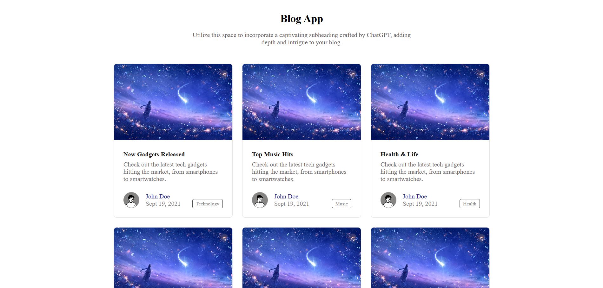

<h1>📝 Blog App</h1>

<p>A simple <b>Blog App front-end project</b> built using <b>HTML and CSS only.</b> This project was created while following the <i>CodeHelp (Love Babbar) YouTube channel tutorials.</i></p>

<h2>✨ Features</h2>

<ul>
    <li>Clean blog-style layout</li>
    <li>Blog cards with images, title, description, and read-more links</li>
    <li>Responsive design using only CSS</li>
    <li>Easy to customize with your own images and text</li>
</ul>

<h2>🛠️ Tech Stack</h2>

<ul>
    <li><b>HTML5</b></li>
    <li><b>CSS3</b></li>
</ul>

<h2>📷 Project Preview</h2>



<h2>🚀 How to Run Locally</h2>

<ol>
    <li>Clone this repository:</li>
    
    ```bash
    git clone https://github.com/your-username/blog-app.git
    Open the project folder.
    Run index.html in any browser.
</ol>

<h2>📌 Note</h2>

<ul>
    <li>The original tutorial used <b>Unsplash API/images</b> for blog pictures.</li>
    <li>I used <b>local images</b> instead, to avoid complexity.</li>
</ul>

<h2>🎯 Learning Outcome</h2>

<ul>
    <li>Understood how to create a <b>card-based blog layout.</b></li>
    <li>Learned to style and position elements using <b>CSS Flexbox/Grid.</b></li>
    <li>Gained experience in <b>using local assets</b> for easier development.</li>
</ul>

<h2>🙌 Acknowledgements</h2>

<ul>
    <li>Thanks to <b>CodeHelp (by Love Babbar)</b> YouTube channel for guidance and inspiration.</li>
</ul>
